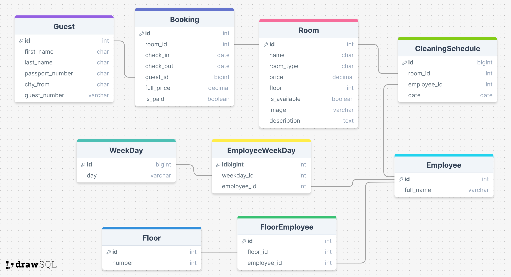
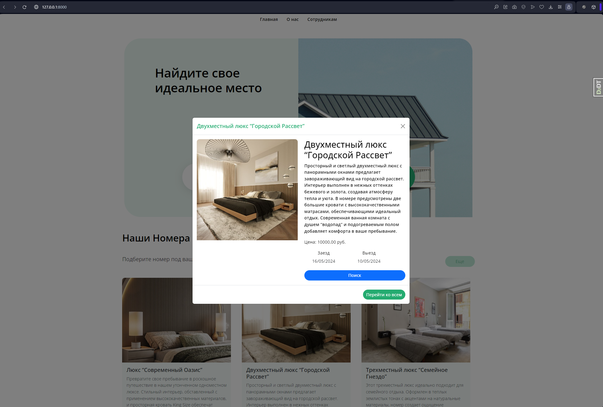

# Проект управления гостиницей

## Описание проекта

Этот проект разработан для управления гостиницей с использованием Django. Он предоставляет администратору возможность управлять номерами, клиентами и служащими, а также выполнять различные запросы и получать отчеты.

## Технологии

- Django
- SCSS
- HTML
- Python
- SQLite
- Git

## Установка

1. Клонируйте репозиторий:
   ```bash
   git clone https://github.com/gargatun/hotel.git
   ```
2. Перейдите в директорию проекта:
   ```bash
   cd hotel
   ```
3. Установите зависимости:
   ```bash
   pip install -r requirements.txt
   ```
4. Выполните миграции базы данных:
   ```bash
   python manage.py migrate
   ```
5. Запустите сервер разработки:
   ```bash
   python manage.py runserver
   ```

## Процесс разработки

### 1. Создание шаблонов

Сначала были созданы шаблоны для веб-страниц, используя SCSS для стилизации. Это позволило обеспечить единый стиль и удобный интерфейс для всех страниц приложения.


### 2. Реализация внутренней логики на Django






Реализация внутренней логики приложения на Django включала создание моделей для клиентов, номеров, служащих и бронирований, а также настройку соответствующих представлений и контроллеров.

Для клиентов была реализована возможность просмотра доступных номеров, фильтрации по типу номера и стоимости, а также бронирование номеров на определенные даты. Клиенты могут выбирать даты заезда и выезда, а также просматривать подробную информацию о номерах.

Бронирование номера
Клиенты могут забронировать номер, выбрав даты заезда и выезда, указав свои контактные данные и город прибытия. После подтверждения бронирования, информация сохраняется в базе данных и становится доступной для сотрудников гостиницы.


#### Структура проекта

Проект имеет следующую структуру:

- **employee**: приложение для управления служащими гостиницы
- **reservation**: приложение для управления бронированиями
- **rooms**: приложение для управления номерами гостиницы
- **hotel**: основное приложение проекта, включающее настройки и маршруты

#### Модели

- **Guest**: хранит информацию о клиентах, таких как имя, фамилия, номер паспорта и город прибытия.
- **Room**: хранит информацию о номерах, включая название, тип, стоимость за ночь, этаж, доступность и изображение.
- **Employee**: хранит информацию о служащих, включая их полное имя, этажи, на которых они работают, и дни недели, когда они работают.
- **Booking**: хранит информацию о бронированиях, включая номер, даты заезда и выезда, гостя, полную стоимость и статус оплаты.
- **CleaningSchedule**: хранит расписание уборки номеров, включая номер, сотрудника и дату.
- **Floor**: хранит информацию о номерах этажей.
- **WeekDay**: хранит информацию о днях недели.


### 3. Настройка админ панели для сотрудников


Для управления данными была настроена административную панель Django, которая позволяет сотрудникам выполнять основные операции по управлению клиентами, номерами и бронированиями. В админ панели также реализована верификация для обеспечения безопасности.

Административная панель позволяет выполнять следующие действия:

- **Управление гостями**: добавление, изменение и удаление информации о гостях.
- **Управление бронированиями**: создание, редактирование и удаление бронирований.
- **Управление номерами**: добавление, изменение и удаление номеров, управление их доступностью и ценами.
- **Управление служащими**: добавление, изменение и удаление информации о служащих, назначение этажей и рабочих дней.
- **Управление расписанием уборок**: создание и редактирование расписания уборок для номеров.


Основные функции системы включают:

- **Стоимость места для заданного этажа и номера.**
- **Список клиентов из заданного города.**
- **Сведения о служащих, убирающих номер указанного клиента в заданный день недели.**
- **Количество свободных мест и номеров.**
- **Список клиентов в одноместных номерах.**
- **Общая сумма, выплаченная всеми клиентами.**

